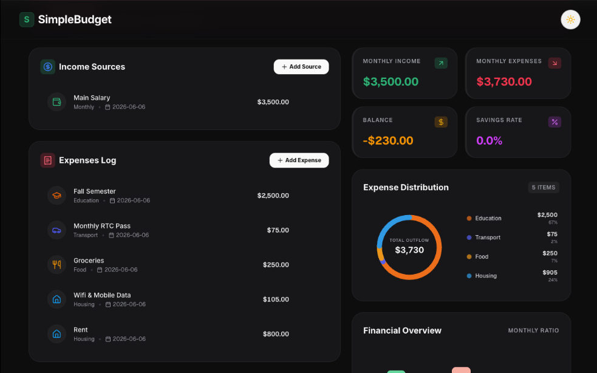

# SimpleBudget

Plan your money visually. SimpleBudget is a modern budgeting tool for tracking income, expenses, and savings with real-time charts and analytics.

## Features

- **Income & Expense Tracking** – Add, edit, and delete transactions with categories and frequencies
- **Monthly Overview** – Visual bar chart comparing income, expenses, and remaining balance
- **Expense Distribution** – Donut chart breaking down spending by category
- **Summary Cards** – At-a-glance metrics for income, expenses, balance, and savings rate
- **Persistent Storage** – Data saved automatically to localStorage
- **Dark / Light Theme** – Toggle between dark and light mode
- **Responsive Design** – Works on desktop and mobile

## Run Locally

**Prerequisites:** Node.js

1. Install dependencies: `npm install`
2. Run the app: `npm run dev`
